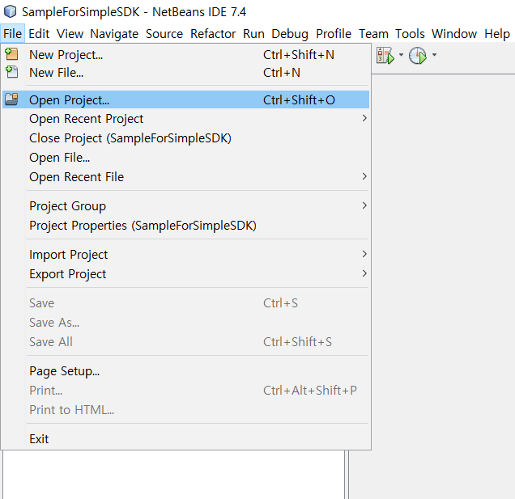
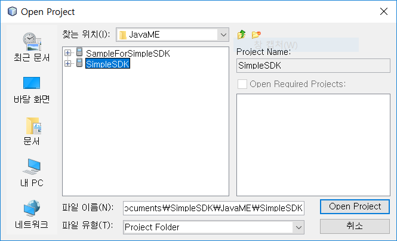
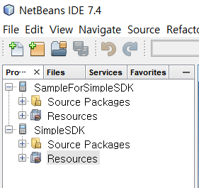
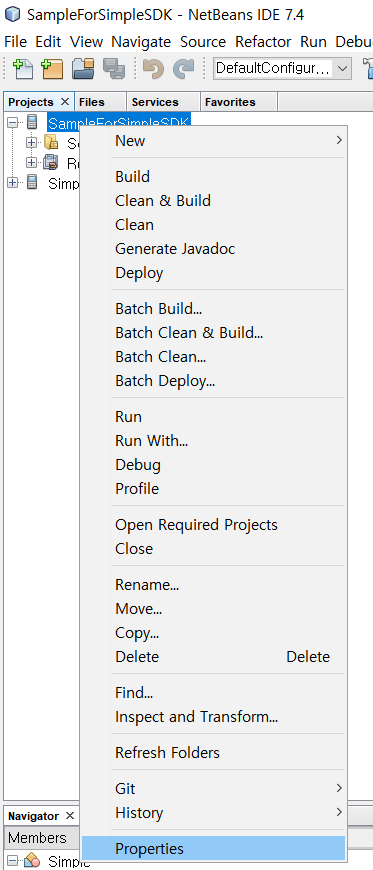
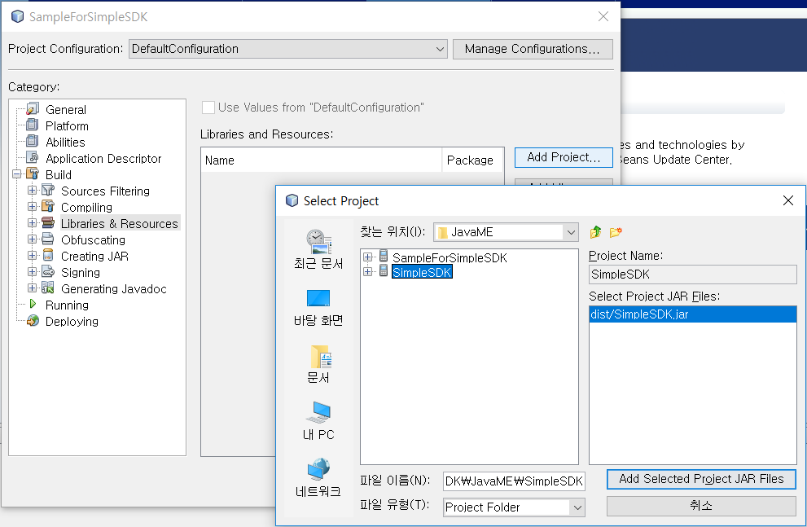
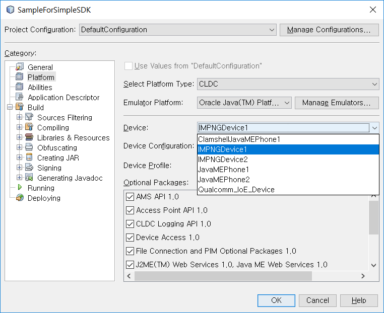
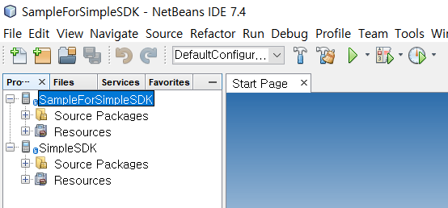
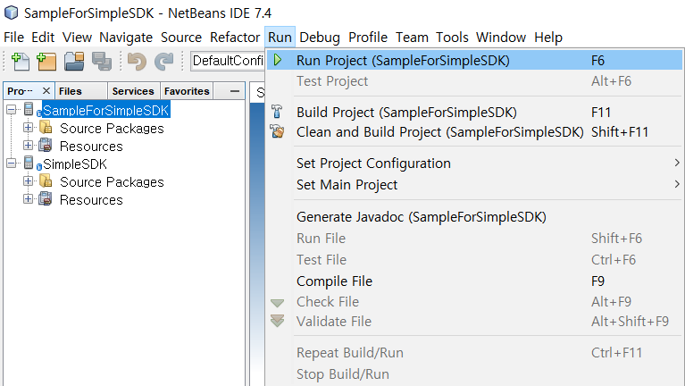
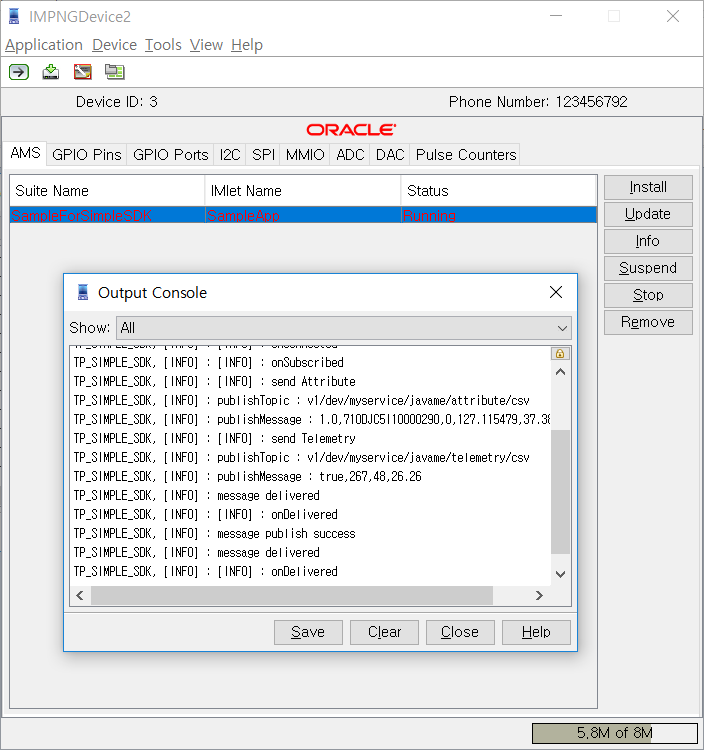

ThingPlug Simple SDK for JavaME(3.2)
===

## Overview
ThingPlug Simple SDK for JavaME는 ThingPlug에 연동하고자 하는 device 개발자 및 application 개발자를 위한 JavaME기반 SDK입니다. IoT device 및 Application과 ThingPlug서버간의 통신에는 Simple 규격에 기반한 MQTT 프로토콜을 따르고 있으며, 보안강화를 위해 TLS를 사용할 수 있도록 구성되어 있습니다

## Features
SDK뿐만 아니라 기본 기능시험을 위한 Simple Test App을 같이 배포해드리고 있습니다.

## Requirements
* 윈도우 설치 PC
* **[Netbeans 7.4](https://netbeans.org/downloads/7.4/)**
* **[JDK 7(7u80)](http://www.oracle.com/technetwork/java/javase/downloads/java-archive-downloads-javase7-521261.html)**

* **[Java ME SDK 3.4](http://www.oracle.com/technetwork/java/embedded/javame/embed-me/downloads/java-embedded-java-me-download-2162242.html)**


### Library
본 SDK에서의 ThingPlug와의 통신은 모두 MQTT를 통해서 이루어기에 MQTT client가 필요합니다.
JavaME SDK에서는 오픈소스 프로젝트인 paho를 사용하며, TLS(SSL) 접속을 위해서 BouncyCastle 암호 패키지를 사용합니다. 

라이브러리 | 기능 | 홈페이지
------------ | ------------- | -------------
__paho__ | MQTT | **[https://eclipse.org/paho/](https://eclipse.org/paho/)**
__Bouncy Castle__ | TLS(SSL) | **[http://www.bouncycastle.org/](http://www.bouncycastle.org/)**
__Json__ | JSON | **[http://www.json.org/](http://www.json.org/)**

## Getting Started
ThingPlug Simple SDK는 소스코드 형태로 제공되며 Application에서의 사용을 위해서는 다음과 같이 연동하여 사용하면 됩니다.
보다 자세한 사용 예시는 **[Simple Test App](SDK)** 소스코드를 참고하시기 바랍니다.

### Project에 Simple SDK 연결
신규 Project에 Simple SDK를 추가하고자 할 경우, 아래와 같이 추가하시기 바랍니다. 

1. Netbeans에 Simple SDK Project 추가
	- `Menu > File > Open Project` 선택
	<br/>
	- Simple SDK Project를 선택 후 `Open Project` 선택
	<br/>
	- IDE에서 프로젝트 확인
	<br/>
2. Project에 Simple SDK Project 연결 및 Emulator 설정
	- Application Project를 선택 후 마우스 우클릭 `Properties` 선택
	<br/>
    
    - Simple SDK Project 연결
        - `Category > Build > Libraries & Resources > Add Project` 선택
        <br/>
    - Emulator 설정
        - `Category > Platform > Device`에서 Target Device 선택
        <br/>

### Simple SDK import

```java
import tp.skt.simple.api.Simple;
import tp.skt.simple.element.ArrayElement;
import tp.skt.simple.api.ResultListener;
import tp.skt.simple.api.Configuration;
import tp.skt.simple.api.ConnectionListener;
import tp.skt.simple.element.RPCResponse;
```

## Simple API 생성
Simple API 를 사용하기 위해서는 Simple 객체를 생성해야 합니다.

```java
Simple simple = new Simple(
	String serviceName, 
	String deviceName, 
	String userName, 
	Configuration configuration, 
	ConnectionListener connectionListener, 
	boolean logEnabled);
```
파라미터 | 설명
------------ | -------------
__serviceName__ | 서비스 이름
__deviceName__ | 디바이스 이름
__userName__ | ThingPlug 계정 ID
__configuration__ | ThingPlug 연결을 위한 값들 세팅
__connectionListener__ |  ThingPlug 연결 이벤트 Listener
__logEnabled__ | 디버깅을 위한 로그 Enable or Disable

### Configuration 생성
Simple 객체 생성을 위해서 Configuration 객체 생성해야 합니다.

```java
Configuration configuration = new Configuration(
        String hostAddress, 
        int hostPort,
        int keepAlive,
        String clientID, 
        String loginName, 
        String loginPassword
    );
```

파라미터 | 설명 |  예시
------------ | ------------- | -------------
__hostAddress__ | ThingPlug Server 주소 | TLS사용 : `ssl://xx.xx.xx.xx`, 미사용 : `tcp://xx.xx.xx.xx`
__hostPort__ | ThingPlug Server Port |  TLS사용 : `8883`, 미사용 : `1883`
__keepAlive__ | ThingPlug Server 연결 Keep Alive | `300`
__clientId__ | ThingPlug 연결을 위한 Client-ID | 디바이스 토큰 : `78a3b1a....`
__loginName__ | ThingPlug 연결을 위한 ID | 디바이스 토큰 : `78a3b1a....`
__loginPassword__ | ThingPlug 연결을 위한 Password | `null`


### ConnectionListener 사용
ThingPlug 서버에 연결 후, 이벤트 처리를 위하여 ConnectionListener 등록해야 합니다.

```java
ConnectionListener connectionListener = new ConnectionListener() {

    public void onConnected() {
        System.out.println("onConnected");
    }

    public void onDisconnected() {
        System.out.println("onDisconnected");
    }

    public void onSubscribed() {
        System.out.println("onSubscribed");
    }

    public void onSubscribeFailure() {
        System.out.println("onSubscribFailure");
    }

    public void onDisconnectFailure() {
        System.out.println("onDisconnectFailure");
    }

    public void onConnectFailure() {
        System.out.println("onConnectFailure");
    }

    public void onConnectionLost() {
        System.out.println("onConnectionLost");
    }


    public void onDelivered() {
        System.out.println("onDelivered");
    }

    public void onMessageReceived(String topic, String payload) {
        System.out.println("onMessageReceived topic : " + topic);
        System.out.println("onMessageReceived payload : " + payload);
    }
};
```

### Simple API 
SKT ThingPlug 서버와 Simple 통신을 위한 API 는 `tp.skt.simple.api.Simple.java` 파일에 정의되어 있습니다.

주요 함수 | 설명
------------ | -------------
__Simple__ | 생성자, 서비스이름, 디바이스 이름, ThingPlug 계정 ID를 세팅한다.
__tpSimpleConnect__ | 서버에 연결한다.
__tpSimpleDisconnect__ | 서버와 연결을 해제한다.
__tpSimpleDestroy__ |  서버연결 및 리소스들을 해제한다.
__tpSimpleIsConnected__ | 서버 연결상태를 확인한다.
__tpSimpleTelemetry__ | 센서정보를 전달한다.
__tpSimpleRawTelemetry__ | 포메팅된 센서정보를 전달한다.
__tpSimpleAttribute__ | 디바이스 정보를 전달한다.
__tpSimpleRawAttribute__ | 포메팅된 디바이스 정보를 전달한다.
__tpSimpleResult__ | RPC 제어결과를 전달한다.
__tpSimpleSubscribe__ | 디바이스정보를 모니터링 한다.
> 각 함수별 파라미터 설명은 `tp.skt.simple.api.Simple.java`에서 확인

* Simple 서버 연결

    ```java
    Configuration configuration = new Configuration(
                    { Simple 서버 주소(ex. tcp://xxx.xxx.xxx.xxx) },
                    { Simple 서버 포트(ex. 1883 },
                    { 서버 연결 keepAlive(ex. 300 },
                    { Simple clientId(디바이스 아이디(ex. 748e...ba2))},
                    { Simple login Name(디바이스 아이디(ex. 748e...ba2))},
                    { Simple login Password( null을 사용)});
    Simple simple = new Simple( 
                    { 서비스 명 },  
                    { 디바이스 명 }, 
                    configuration,
                    connectionListener,
                    true );

    simple.tpSimpleConnect();

    ```

* Attribute 전송
    ```java
    ArrayElement element = new ArrayElement();
    element.addStringElement("sysHardwareVersion", "1.0");
    element.addStringElement("sysSerialNumber", "710DJC5I10000290");
    element.addNumberElement("sysErrorCode", 0);
    element.addNumberElement("sysLocationLongitude", 127.115479);
    element.addNumberElement("sysLocationLatitude", 37.380257);
    simple.tpSimpleAttribute(element, callback);
    ```
     or

    ```java
    String data = "{\"rawData\":\"true\",\"sysLocationLatitude\":37.380257,\"sysHardwareVersion\":\"1.0\",\"sysLocationLongitude\":127.115479,\"sysErrorCode\":0,\"sysSerialNumber\":\"710DJC5I10000290\",\"led\":0}";
    
    simple.tpSimpleRawAttribute(data, DataFormat.FORMAT_JSON, callback);
    ```  

* Telemetry 전송
    ```java
    ArrayElement element = new ArrayElement();
    element.addNumberElement("light1", 267);
    element.addNumberElement("humi1", 48);
    element.addNumberElement("temp1", 26.26);
    simple.tpSimpleTelemetry(element, false, callback);
    ```
     or 
    ```java
    String data = "{\"rawData\":\"true\",\"light1\":267,\"humi1\":48,\"temp1\":26.26}";
            
    simple.tpSimpleRawAttribute(data, DataFormat.FORMAT_JSON, callback);
    ```  

### 빌드 및 실행
- 빌드할 프로젝트 선택
    > 프로젝트를 선택하지 않으면, 현재 수정하고 있는 파일의 프로젝트가 빌드가 됩니다. 
  <br/>
- `Menu > Run > Run Project({프로젝트 명})`를 선택하여 빌드하여 실행합니다.
  > `Project Properties` 의 `Category > Platform > Device`에 설정된 Device로 실행이 됩니다. 
  <br/>
- Emulator 실행화면
    <br/>

Copyright (c) 2017 SK Telecom Co., Ltd. All Rights Reserved.
Distributed under Apache License Version 2.0.


